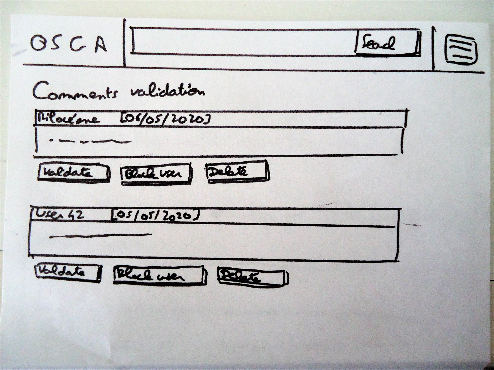
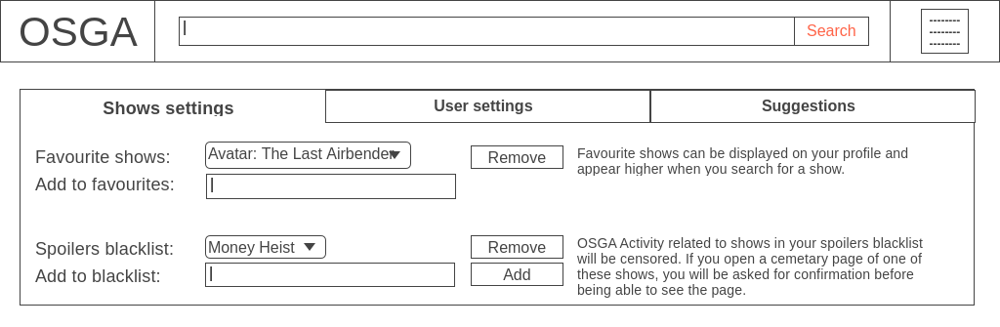

# OSGA: One Site to Grieve them All -- Design Document

OSGA is a mourning place for all lovers of TV shows who lost their favourite character on screen.
Each universe has its own cemetary, where you can find the resting place of your favourite character and leave messages and flowers.

## Features

The main interface design will probably be one of the two "screens" sketches here under. It doesn't require other features than searching for a cemetary.

### Basic features for visitors

* Selection of a TV-show / universe
* Access to cemetary and visualisation of graves of the deceased characters of the show
* Click to add a flower to the grave (one flower/cemetary/day)
* Hover over grave to see messages left by users

### Basic features for users with an account

* Settings page with:
	* Show settings: 
		* List of favourite shows (can be displayed on profile)
		* Blacklist of shows about which the user doesn't want to accidentally be spoiled
	* User settings
		* Possibility to update e-mail and password
		* Checkbox to decide whether activity and favourite shows should be private or public

* Possibility to leave (moderated) message in the form of "engraved plaque" on graves

* Access to more different types of flowers
* 10 flowers/cemetary/day
* Possibility to suggest new shows/universes to add to the website
* List of favourite shows (cemetaries easily accessibles)
* User profile that displays activity (private or public)

### Admin features

* Moderation of comments left by users on graves
* Block certain email addresses
* Update on character deaths

### Extensive features (optional implementations)

* Support of specific "death/no death" cases: characters ressucitated or reincarnated, time travel...
* Specific design per universe/group of characters/characters
* Users can have friends (via email or username) and are able to see their activity (if they allow it)
* Support of movies and books universes
* Aministration of moderators (rights and roles per universe)
* Character mourning page (accessible via link on grave): picture, dates,  number of items left by users, list of messages etc.
* Users can add other (moderated) content such as fan arts
* Unique non-free content (specific objects to add on graves)
* User can upload avatar picture
* "Report" button
* "Share" button (on Facebook etc.) for messages left on graves
* Provide an API with deceased characters and their statistics

## User Interface

### Summarized view

Here is a schema that sums up a basic user experience on OSGA. Clicking on the picture enlarges it and below are independant view of each screen drawing.

### Cemetary page: logged-out and logged-in versions

### User panel

### User profile

## Database structure

The basic features will be implemented base on the structure described by the following UML diagram.
The table "Character" refers to characters that have been declared dead by administrators. Characters still living in shows don't need to be included in the database, as their data is easily accessible via the API.

Possible changes will need to be done in the future, to manage specific cases (characters ressucitated or reincarnated, time travel...). Those specific cases will not be handled in the basic version of the website.

## Frameworks and data usage

The following tools are going to be used:
* PostgreSQL: for storage of the data (see UML diagram hereabove)
* Flask: for HTML webpages management via Python
* SQLAlchemy: for PostgreSQL management via Python with Flask
* Jinja2: for HTML templating, in combination with Flask rendering
* Bootstrap2: for HTML formatting (top bar, user panel)
* Javascript: for dynamic usage by the user, especially on the cemetary pages (click to leave flower or message)

A large part of the base data is going to be acquired from the trakt tv API:
* shows names
* shows seasons and episodes
* shows characters

This data and the API will only be used by the administration part of the website: when an admin wants to add a cemetary or declare a character dead, they will be able to choose among shows/characters known by the API. When declaring a death, they will be able to indicate during which episode of which season of the show the character died.

Users will only interact with OSGA's data: adding flowers or messages to a character, changing their user preferences.