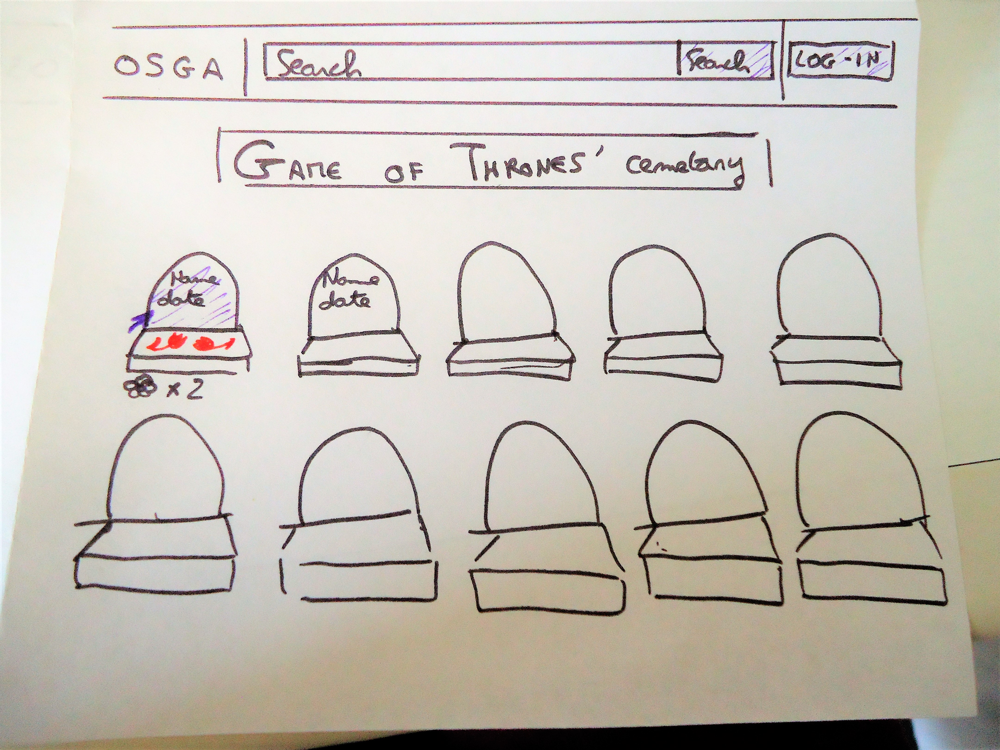
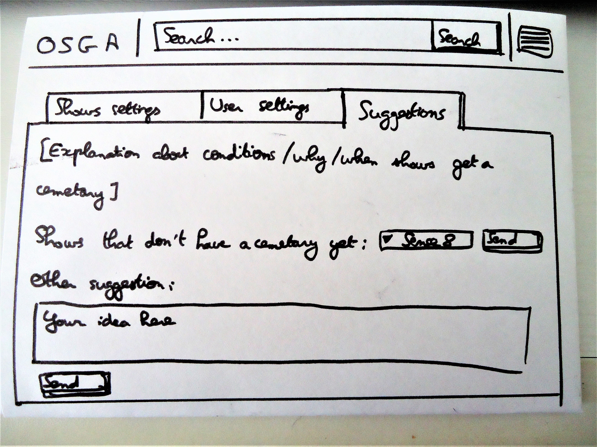

# OSGA: One Site to Grieve them All

[OSGA](https://miloceane-osga.herokuapp.com/) is a mourning place for all lovers of TV shows who lost their favourite character on screen.
Each universe has its own cemetary, where you can find the resting place of your favourite character and leave messages and flowers.

Click [here](https://miloceane-osga.herokuapp.com/) to browse OSGA and on the picture here under to access a presentation video (with screencast):

## Problem statement

We all know the pain of losing our favourite character in a book, movie or TV show. Certain authors make it a point to make characters very likeable and relatable and to kill them suddenly, sometimes really unfarily (Game of Thrones, anyone?). Sure, they are "only fictional", but does that mean we aren't allowed to mourn them the same way as any being we got attached to and have been through countless adventures with? Are FanArts, music videos and complaints on social media really enough? It's time TV shows fans got an actual mourning place to grieve their favourite characters!

## Solution description

Some years ago, when the show was still running, the website Slate made a [fictional graveyard](http://www.slate.com/articles/arts/television/2014/04/game_of_thrones_deaths_mourn_dead_characters_at_their_virtual_graveyard.html) (spoiler alert!) where it was possible to leave flowers on the graves of deceased Game of Thrones characters. Osga will offer mourning places similar to this one, but for more than one show: users will be able to leave flowers and messages on the graves of deceased characters and to see what other users left.

## Details and sketches

The main interface design will probably be one of the two "screens" sketches here under. It doesn't require other features than searching for a cemetary.

### Most important interface: cemetary view

### User panel for registered users

## Prerequisites

### API

This application will use the [trakt tv API](https://trakt.docs.apiary.io/) as preferred API. Trakt tv API offers information about shows such as a list of existing series, their number of episodes and which actor plays which character, which is very valuable info for OSGA. On top of that, trakt tv collects information about viewers preferences: this might be useful if this application is further developed in the future and uses users' info for more extensive features.

### External components

* Flask + sqlalchemy: Flask and sqlalchemy will be used for the main implementation of the application (Python + PostgreSQL) (see requirements in requirements.txt)
* Bootstrap + jinja2: Bootstrap and Jinja2 will be used for the frontend of the website
* Javascript: Javascript will be used to make the website dynamic, for instance to leave flowers or messages on graves without needing to refresh the page.

### Similar websites

To my surprise, the only similar website I have found it the one my idea came from: Slate's [fictional graveyard for Game of Thrones characters](http://www.slate.com/articles/arts/television/2014/04/game_of_thrones_deaths_mourn_dead_characters_at_their_virtual_graveyard.html) (spoiler alert!).
Osga's features will clearly be based on this website: visiting a virtual cemetary and only needing to click on a grave to leave flowers and feel less pain from the death of a character. It is also made with HTML and Javascript, and I can probably make something similar (the basic features are simple!). 

If we look at websites used as memorials of real persons, [Remembr](https://www.remembr.com/) seems to be the main international site. The search features are naturally quite different. The whole website is very neutral without being cold, which fits perfectly with its goal. However, for OSGA, I believe a more friendly atmosphere is needed, because even if the feelings related to grieving our favourite characters are real, we don't rationally take their death as seriously as a real person's passing. As for the features, Remembr displays a description of the person's life. I don't think that is necessary for OSGA, as the visitors will only look for characters they alreado know. Besides this, Remembr allows actual messages of condoleances, as well as the possibility to share the memorial page of a person on social network (which Slate's application doesn't do). It is not necessary to have an account to leave condoleances. However, in OSGA's case, the user would benefit from an account to have access to other features, and leaving the possibility to leave messages only to users with an account will make moderation easier.

[Dans Nos Coeurs](https://www.dansnoscoeurs.fr/) (French for "In Our Hearts") is a French equivalent to Remembr. Besides virtually leaving flowers or lighting a candle, users can pay for concrete, actual services: planting actual trees (in a real forest) in memory of the person they are grieving, sending flowers to the family, paying for the maintenance of the grave... Those things are not relevant for OSGA, but shows that a lot more can be done than just leaving a message or flowers in order to help grieving. As for the information about the deceased person, their page not only describes their life, but mentions their closest family members, shows pictures of them and if trees have been planted in their memory, mentions those as well as where they are. If OSGA ever gets specific pages per deceased character, pictures of the characters and actions made in memory of them should be displayed in a similar way.

On a technical level, Remembr and Dans Nos Coeurs seem to be a lot more static than Slate's page. It makes the user experience slower, which is not a problem as the user doesn't need to quickly go from one feature to another. Naturally, people grieving real deaths and people grieving fictional characters, although sharing sometimes similar feelings, are very distinct groups of people with very different needs. When we grieve one character from a TV show, we are most likely to also want to visit other characters we miss too, so I think the way Slate's fictional graveyard is made (making it possible to check on several character's grave in one view) remains more relevant to OSGA's users than the way memorial websites for actual persons are made.

### Hardest parts

The hardest part of the implementation to me is going to be the use of Javascript. I haven't had a lot of success with this language in the past and this application will require a lot of it. Producing a neat, bug-free Javascript code for this application will probably be challenging. I'm especially expecting the implementation of the cemetary view / click on the grave to add flowers or messages, to take the most time.

Another hard part is going to be the design (drawing graves, flowers, and making the main page of the application). It doesn't need to be pretty to be functional, but I would like it to be. However, this is secundary, and I will only make it look nice once the basic features are implemented.

## Author

Milocéane is a CS student from France and the Netherlands, currently studying at the University of Amsterdam.
This application was made as "end project" for the Web Apps part of the minor "Fulltime Programmeren".

